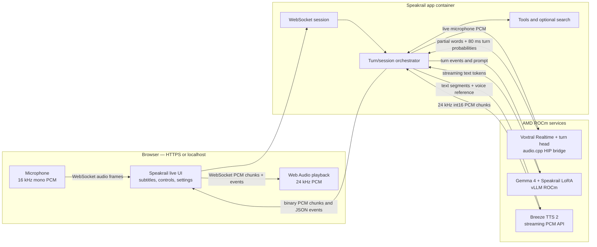

# Speakrail

Speakrail is a full-duplex voice assistant. It streams microphone audio to a
live speech recognizer, makes turn-taking decisions while the user is speaking,
generates a reply, and streams speech back to the browser. The same application
has an NVIDIA Compose deployment and an AMD ROCm deployment.

This repository is an official fork of
[`speakrail/speakrail`](https://github.com/speakrail/speakrail). It keeps the
upstream NVIDIA deployment and adds a tested AMD ROCm deployment path and its
ROCm build files.

## Pipeline



### What happens during a turn

1. The browser captures mono microphone audio, resamples it to 16 kHz, and sends
   PCM frames to the app over a WebSocket.
2. The app forwards the frames to the Voxtral streaming recognizer. The ASR
   bridge returns recognized words and turn-head probabilities at roughly
   80 ms intervals.
3. The session orchestrator combines words, silence, and turn-head output. It
   can continue listening, end a turn, interrupt a reply, or allow a
   backchannel. When the user appears done, it can start a response while the
   last recognition frames are being drained.
4. The app sends the conversation to Gemma 4 served by vLLM with the Speakrail
   LoRA adapter. Text tokens stream back as they are generated. Tool calls
   (calculator, notes, timers, weather, and related utilities) are handled by
   the app; web search is an optional integration.
5. The app groups text into speech segments and sends each to Breeze TTS with a
   reference voice. Breeze streams 24 kHz int16 audio back to the app.
6. The app forwards audio chunks to the browser. The browser schedules them on
   a Web Audio timeline and renders subtitles, status, and optional timings.

The debug page is at `/debug/`. The live page is `/`. Microphone access requires
`localhost` or a secure HTTPS origin. Browser microphone and speaker selection
uses devices visible to the browser's own computer.

## AMD ROCm deployment

The AMD path is an experimental RDNA4 setup. It was exercised on Radeon AI PRO
R9700 (`gfx1201`) and RX 9070 (`gfx1201`) GPUs with ROCm 7.2. It builds a HIP
Voxtral service, runs Breeze on ROCm, and serves Gemma through a ROCm vLLM image.

### GPU placement

The Compose file uses the host's ROCm device order:

| Service | Container GPU | Work |
|---|---:|---|
| ASR | `HIP_VISIBLE_DEVICES=0` | Voxtral and turn-head inference |
| TTS | `HIP_VISIBLE_DEVICES=0` | Breeze speech generation |
| LLM | `HIP_VISIBLE_DEVICES=1` | Gemma 4 and the Speakrail LoRA |

Adjust these assignments in `compose.amd.yaml` if the host enumerates its GPUs
differently. All three services need access to `/dev/kfd` and `/dev/dri`, and
the Docker user must have the `video` and `render` groups.

### Prerequisites

- Linux with an AMD RDNA4 GPU supported by the installed ROCm release.
- Docker Engine with the Compose v2 plugin.
- ROCm device nodes available on the host (`/dev/kfd` and `/dev/dri`).
- Git and a working network connection for the pinned source builds and model
  downloads.
- Roughly 22 GB of model files plus space for Docker images and build layers.
- Hugging Face access to the pinned Gemma and Breeze model repositories. Accept
  any model terms before downloading.

Model files are not stored in Git. They are downloaded by the existing
`model-init` service into a host directory mounted read-only by the GPU
containers.

### First setup

```bash
cp .env.example .env
```

Set the same host directory for both `MODELS_DIR` and
`SPEAKRAIL_MODELS_DIR` in `.env`. Use a disk with enough free space; the AMD
Compose path defaults to `./models` if `SPEAKRAIL_MODELS_DIR` is omitted. Add
`HF_TOKEN` to `.env` if Hugging Face requires authentication for your account.

Download and verify the pinned model artifacts with the regular model-init
service:

```bash
docker compose run --rm model-init
```

Build and start the AMD stack:

```bash
docker compose -f compose.amd.yaml up -d --build
docker compose -f compose.amd.yaml ps
docker compose -f compose.amd.yaml logs -f asr tts llm app
```

Open `http://localhost:8604/` on the host. For remote browser access, expose
port 8604 through an HTTPS service such as Tailscale Serve. HTTPS terminates
outside this Compose stack; do not expose the app's plain HTTP port directly to
the public internet.

Stop the stack while retaining models and app data:

```bash
docker compose -f compose.amd.yaml down
```

### AMD services and implementation notes

- `asr`: builds the pinned Speakrail audio.cpp revision with HIP enabled for
  `gfx1201`, then runs the Voxtral bridge and turn head.
- `tts`: starts the pinned Breeze TTS revision with ROCm PyTorch. Local patches
  add eager depth graph capture and configurable RVQ codebook depth.
- `llm`: adds the pinned Transformers implementation needed by Gemma 4 Unified
  to the selected ROCm/vLLM base image, then serves the model and LoRA.
- `app`: the existing Python session server, browser UI, tools, and service
  adapters. It does not need a GPU.

The tested 16-level Breeze setting preserves the full codec depth but was
measured below real time on this host. A 12-level test improved throughput to
about 1.07–1.11 seconds of generated audio per second of wall time, with some
loss of voice fidelity. The Compose default remains 16; use
`BREEZE_DEPTH_LEVELS=12` in `.env` to compare the faster setting. This is a
quality/speed tradeoff, not a guaranteed fix for every audio device or browser.

### AMD checks and troubleshooting

```bash
docker compose -f compose.amd.yaml ps
docker compose -f compose.amd.yaml logs --tail=100 asr tts llm app
curl -fsS http://localhost:8604/
```

- ASR and TTS health checks should pass before the app is ready. Gemma can take
  several minutes to load on a cold start.
- Check host GPU ordering if a service sees the wrong card. Inside a container,
  `HIP_VISIBLE_DEVICES` remaps the selected host GPU to device 0.
- If the UI loads but microphone capture fails, use HTTPS or `localhost` and
  grant microphone permission in the browser.
- The browser's speaker picker only shows devices attached to the machine
  running that browser. Select a device in Settings and restart the voice
  session for the selection to apply.
- Session logs and audio recordings can contain private speech. They are
  disabled by default; keep generated sessions and recordings out of Git.

## NVIDIA deployment

The original NVIDIA Compose path remains available for a supported NVIDIA GPU:

```bash
cp .env.example .env
docker compose up -d
```

That path uses NVIDIA Container Toolkit and downloads the same pinned model
artifacts on first startup. Its default UI port is 8080. See `compose.yaml` and
`.env.example` for NVIDIA-specific settings.

## Repository layout

```text
app/                    Web UI, WebSocket server, session logic, tools, TTS client
services/asr/           audio.cpp bridge and NVIDIA/ROCm container builds
services/tts/           Breeze container builds and local streaming patches
services/llm/           ROCm vLLM/Transformers image extension
services/model-init/    Pinned model downloads, checksums, and Gemma row patching
services/search/        Optional SearXNG configuration
tests/                  Session and protocol tests
compose.yaml            NVIDIA stack
compose.amd.yaml         AMD ROCm stack
```

## Configuration and privacy

- Copy `.env.example` to `.env`; `.env` is ignored by Git. Never commit access
  tokens or API keys.
- Keep downloaded models outside Git. Model weights are ignored by `.gitignore`
  and are mounted read-only into inference services.
- Session logs, context, and audio may contain user speech. Review privacy
  implications before enabling `SESSIONS_DIR` or sharing captured output.
- Search and paid external-model tools require separate services or keys. Keep
  them disabled unless intentionally configured.

## Models and licenses

Speakrail code is licensed under the [Apache License 2.0](LICENSE). Model
weights are downloaded separately and retain their own terms; see [NOTICE](NOTICE).
Breeze TTS 2 model weights and generated audio are restricted to research and
non-commercial use by their license. Replace Breeze before using Speakrail
commercially.

The model-init service downloads pinned revisions and verifies key artifact
checksums. It fetches Gemma 4, the Speakrail LoRA and tokenizer rows, Voxtral
Realtime and its turn head, and Breeze TTS 2.
